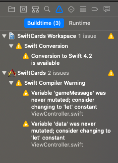

# SwiftCards
Swiftcards is an iOS app that acts as a deck of cards allowing up to 2 people to play whatever game of cards they like!

## Contributing
* Run `gem install cocoapods` to install the dependency manager to your machine if it isn't already.
* Run `pod install` to install dependencies.

## Using the app
* Clone this repo `git clone https://github.com/IrinaSTA/swiftcards.git`
* You will need to open the directory `SwiftCards` in Xcode. If you don't have Xcode installed please [click here](https://developer.apple.com/xcode/) for more information. For more information about using Xcode, you may want to have a look at [this page](https://github.com/IrinaSTA/swiftcards/wiki/XCode-Basics).
* To run the app, please use your simulator in Xcode by clicking the play button in the top left hand corner of your screen. If you would like to read more about this please see [this page](https://github.com/IrinaSTA/swiftcards/wiki/XCode-Basics#running-ios-simulator). You can select to run this on your own iPhone device, please ensure that you have selected your own personal team in the Signing settings.

## Running the Tests
Tests are written using Xcode's testing suite XCTest and need to be run in Xcode. Once you have opened the file, click on the `test navigator` icon in your navigation pane. Click on the play button next to the tests to run them, the UI tests and the Unit tests are run separately.

Tests are all currently passing and test coverage is 91.2%.

## Linting
Linting is built in to Xcode, once you have built the app click the `issue navigator` icon to see any linting errors, these shows as yellow warnings like thisL

Please note that the app has been built using Swift version 4 due to device compatibility issues. If you are running Xcode 10 you will get a linting error letting you know that you can upgrade, please do not do this.

## Learning Documentation
Learning documentation can be found [here](https://github.com/IrinaSTA/swiftcards/wiki). This is a collection of notes that have been taken by the team throughout the duration of the project and may help with any questions that you have.
